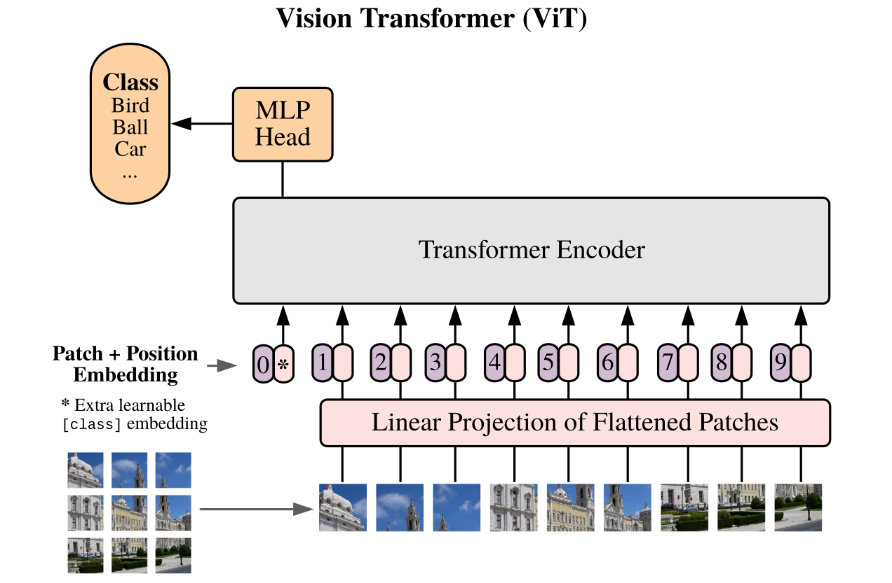
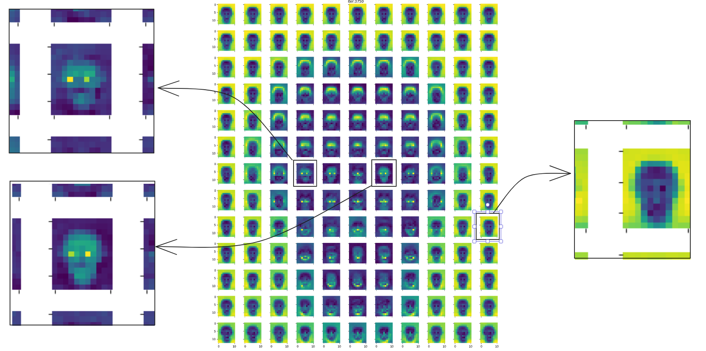

# Patch Embedding for Vision Transformers.

This repository offers a PyTorch implementation of PatchEmbedding from [An Image is Worth 16x16 Words: Transformers for Image Recognition at Scale](https://arxiv.org/abs/2010.11929) ( https://arxiv.org/abs/2010.11929 ).  
The PatchEmbedding is used for a Vision Transformer model and trained on Celeb-A dataset for multi-label classification task.

<figure align="center">

<figcaption align = "center">
<b>The image is split into fixed-size patches, linearly projected to model_dim and positional embeddings are added.  
The resulting sequence is then fed into a standard Transformer Encoder.
</b></figcaption>
</figure>

### Visualizing Position Embeddings
Progression of position embeddings' similarity over the course of training.  
The ViT here was trained on images of size 176(W)x208(H) with patch size of 16x16. i.e. each image was sliced up into 11x13 patches.  
The pixels in the first tile is of shape 11x13, which represent the cosine similarity of the positional embedding of the first patch to the positional embedding of the rest of the patches.  

<figure align="center">

<figcaption align = "center"><b>Similarity of Learned Position Embeddings</b></figcaption>
</figure>

<figure align="center">

<figcaption align = "center">
<b>left: PE of patches near left eye position are similar to PE of patches near the right eye. 
right: PE of patches near boundary positions are similar to other patches that lie on the boundary.</b>
</figcaption>
</figure>

## Large-scale CelebFaces Attributes (CelebA) Dataset
A large-scale face attributes dataset with more than 200K celebrity images, each with 40 attribute annotations.

    @inproceedings{liu2015faceattributes,
    title = {Deep Learning Face Attributes in the Wild},
    author = {Liu, Ziwei and Luo, Ping and Wang, Xiaogang and Tang, Xiaoou},
    booktitle = {Proceedings of International Conference on Computer Vision (ICCV)},
    month = {December},
    year = {2015} 
    }